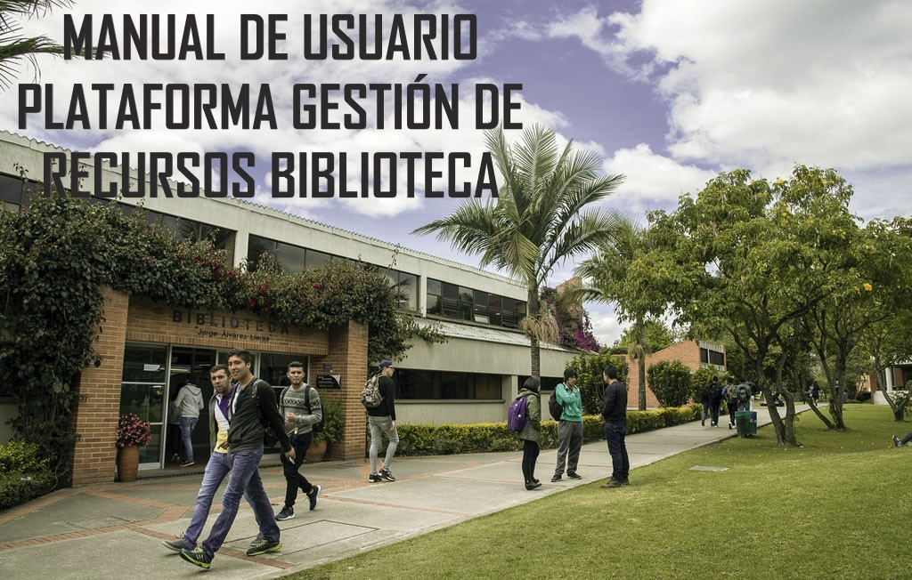

# Proyecto

## cuentas administardores

       correo : fernando.barrera@mail.escuelaing.edu.co
       password: ciclos1
       
       correo : carlos.gomez@mail.escuelaing.edu.co
       password: ciclos2
       
         
       correo : sebastian.caseres@mail.escuelaing.edu.co
       password: ciclos3
       
## Cuentas estudiantes

       correo : miguel.sanchez@mail.escuelaing.edu.co
       password: ciclos4
       
## Modelo relacional

  

# Manual de Usuario

## Contenido

### 1. Instroducción
### 2. Visión general de la aplicación online 

## Introducción

La appbiblioteca15 es una herramienta donde el personal de la biblioteca pertenecientes a la Escuela Colombiana de Ingeniería Julio Garavito, pueden registrar las salas de estudio, equipos de cómputo y demás recursos con los que cuenta la biblioteca, junto con los horarios de disponibilidad y demás información importante.

Esta app como principales funciones y mas obejtivas al enfoque de esta aplicacion, descritas durante el contenido del manual. Son las siguientes tres.

### 1.1. Registrar.
### 1.2. Consultar.
### 1.3. Modificar.

Todas estas funcionalidad se usas hacia los recursos existente en la biblioteca.

La aplicación es intuitiva y fácil de usar: no necesita tener conocimientos de programación, ni nociones de diseño, etc. Tan sólo tiene que iniciar sesión y manipular los recursos a su acomodo, con las accione descritas anteriormenmte. 

La pagina se adapta a cualquier dispositivo (PCs, Tablets y Smartphones) sin necesidad de ningún paso extra.

       
