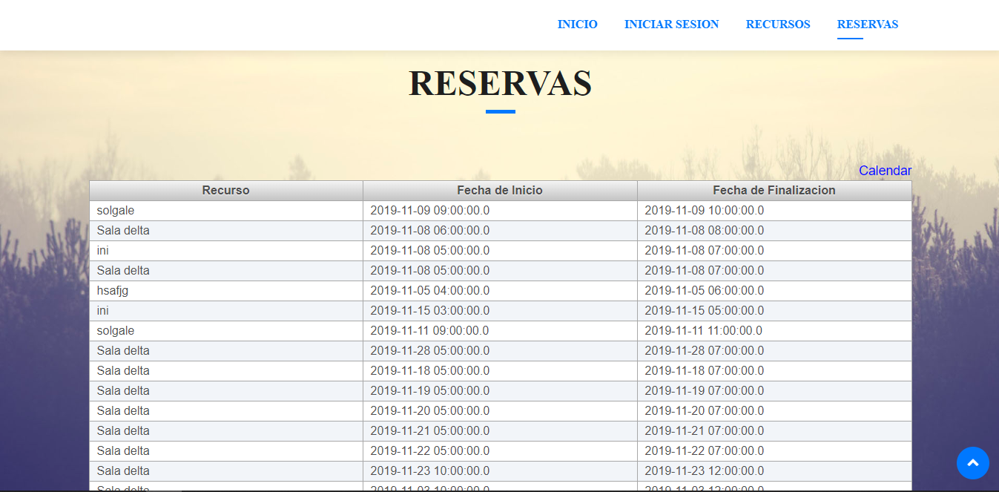
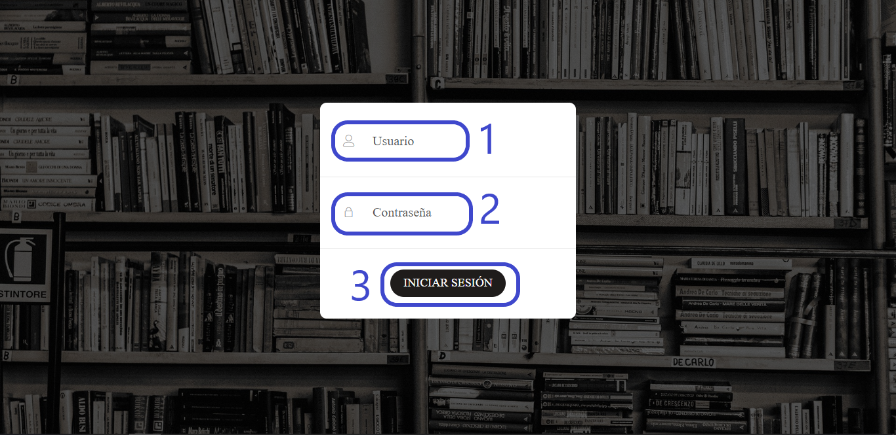
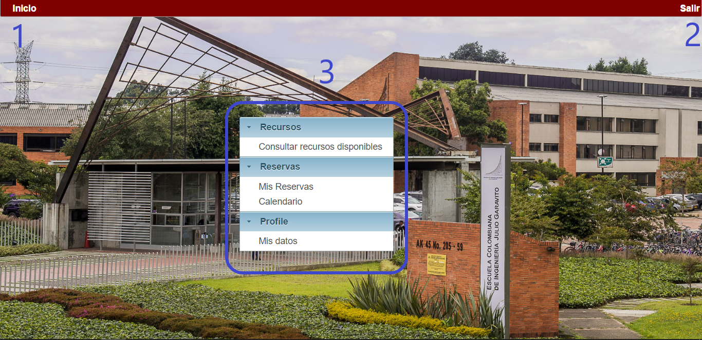

# App Biblioteca

Plataforma que gestiona los recursos de la biblioteca de la Escuela Colombiana de Ingeniería Julio Garavito.

**Perdiodo académico:** 2019-2

**Materia:** Ciclos de vida del Desarrollo de Software
## Participantes y roles ## 

**PRODUCT OWNER:**  
- SANTIAGO ALZATE

**TEAM DEVELOPER:**
- FERNANDO BARRERA
- CARLOS JULIAN GOMEZ
- SEBASTIAN CACERES

## Descripción ## 
App Biblioteca es una aplicación, la cual, busca la eficiencia a la hora de registrar, reservar, consultar y entre otras acciones, recursos como equipos de computo, salas de estudio, tableros inteligentes, etc, de las diferentes bibliotecas con las que cuenta la Escuela Colombiana de Ingeniería Julio Garavito. 
La aplicación permite manejar diferentes tipos de usuarios (administrador y estudiantes) los cuales tienen diferentes rangos de actividades en la aplicación. 

A continuación veremos algunas de las cuentas administradoras y de estudiantes

### Cuentas Administardores ###

       correo : fernando.barrera@mail.escuelaing.edu.co
       password: ciclos1
       
       correo : carlos.gomez@mail.escuelaing.edu.co
       password: ciclos2
       
         
       correo : sebastian.caseres@mail.escuelaing.edu.co
       password: ciclos3
       
### Cuentas Estudiantes ###

       correo : miguel.sanchez@mail.escuelaing.edu.co
       password: ciclos4 

# Manual de Usuario

## Contenido

### 1. Instroducción
### 2. Visión general de la aplicación online 
### 3. Consultar recursos
### 4. Consultar reservas 
### 5. Iniciar sesión
### 6. Cuenta estudiante

## 1. Introducción

La appbiblioteca15 es una herramienta donde el personal de la biblioteca pertenecientes a la Escuela Colombiana de Ingeniería Julio Garavito, pueden registrar las salas de estudio, equipos de cómputo y demás recursos con los que cuenta la biblioteca, junto con los horarios de disponibilidad y demás información importante.

Esta app como principales funciones y mas obejtivas al enfoque de esta aplicacion, descritas durante el contenido del manual. Son las siguientes tres.

### 1.1. Registrar.
### 1.2. Consultar.
### 1.3. Modificar.

Todas estas funcionalidad se usas hacia los recursos existente en la biblioteca.

La aplicación es intuitiva y fácil de usar: no necesita tener conocimientos de programación, ni nociones de diseño, etc. Tan sólo tiene que iniciar sesión y manipular los recursos a su acomodo, con las accione descritas anteriormenmte. 

La pagina se adapta a cualquier dispositivo (PCs, Tablets y Smartphones) sin necesidad de ningún paso extra.

## 2. Pagina principal. 

El panel principal se divide en dos areas:

2.1 Barra de menu: Muestra información sobre el área o contenido que haya seleccionado. 

2.2 Área principal:  Por defecto, muestra el contenido de la web. Muetra algunos anuncios, como funcionalidades nuevas, proximas actualizaciones y etc.

## 3. Consultando recursos

Desde la pagina principal, por medio del boton RECURSOS ubicado en la barra de menu. Accederemos a los recursos disponibles.

## 4. Consultando reservas

Desde la pagina principal, por medio del boton RESERVAS ubicado en la barra de menu. Accederemos a las reservas disponibles.

## 5. Iniciar sesión

Desde la pagina principal, por medio del boton INICIAR SESIÓN ubicado en la barra de menu.

5.1 Usuario: Campo para escribir el usuario asignado.

5.2 Constraseña: Campo para escribir la contraseña del usuario.

5.3 Boton Iniciar Sesión: Boton para confirmar datos e ingresar como usuario.

## 6. Cuenta estudiante 

6.1 Inicio: Boton que redirecciona a la cuenta estudiante.

6.2 Salir: Boton que redirecciona a la pagina principal.

6.3 Menu: Funciones asignadas a la cuenta estudiante.

## Badges ##

## Arquitectura y Diseño ##

### Modelo relacional ###

### Stack de tecnologías ###
- PrimeFaces 
- Guice
- PostgreSQL
- JUnit

### Enlaces ###
- [Heroku](http://appbiblioteca15.herokuapp.com/)
- [CircleCI](https://circleci.com/gh/Team-Ciclos-2019)

## Descripción del proceso ##

### Team ###
- Fernando Barrera
- Carlos Julian Gomez
- Sebastian Caceres

### Metodología ###
La metodología que se implementó fue SCRUM, la cual, es usada a nivel mundial por empresas lideres en el mercado tales como Microsoft, Google, BBC, entre otras.
SCRUM cuenta con una planeación, antes de iniciar el tiempo de la implementación de las tareas (Sprint) requeridas por el cliente. La duración de cada Sprint en nuestro proyecto fue de 2 semanas. Al finalizar cada Sprint se da un feedback para saber como mejorar para futuras sesiones de tiempo.

**Enlace Taiga:** [Taiga](https://tree.taiga.io/project/carlos380-gestion-de-recursos-biblioteca/backlog)

## Información de cada Sprint ##

## Sprint #1 ##

### Sprint - Backlog ###

### Sprint - BurnDown Chart ###

### FeedBack ###
- Falta de organizacón por parte de los desarrolladores del back, implementamos las tareas dos veces, causando perdida de tiempo.
- Falta de trabajo del desarrollador encargado de la parte visual, no se hizo ninguna vista de las tareas.
- Subtareas demasiado grandes.

## Sprint #2 ##

### Sprint - Backlog ###

### Sprint - BurnDown Chart ###

### FeedBack ###
- Hubo muchos problemas al implementar la parte del calendario
- Falta de trabajo del desarrollador encargado de la parte visual, no se hizo ninguna vista de las tareas de este Sprint.
- Por parte de los desarrolladores del Back hubo un buen trabajo.
- Hubo un cambio de roles en cuanto a Front y Back viendo las necesidades del equipo.

No se manejó de manera adecuada el tiempo, ni priorizamos las tareas actuales 
## Sprint #3 ##

### Sprint - Backlog ###

### Sprint - BurnDown Chart ###

### FeedBack ###

- Uno de los desarrolladores del Front no se comunicó con el equipo, y no entregó vistas 
- A pesar de dividir las tareas y dedicar mas tiempo del estimado, la parte del Front quedó mas atrasada que la del Back.

## Reporte de pruebas ##

